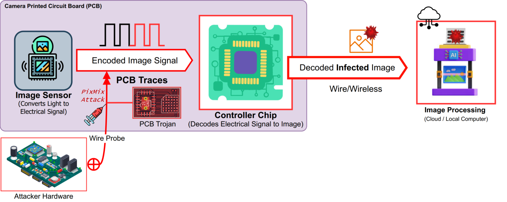
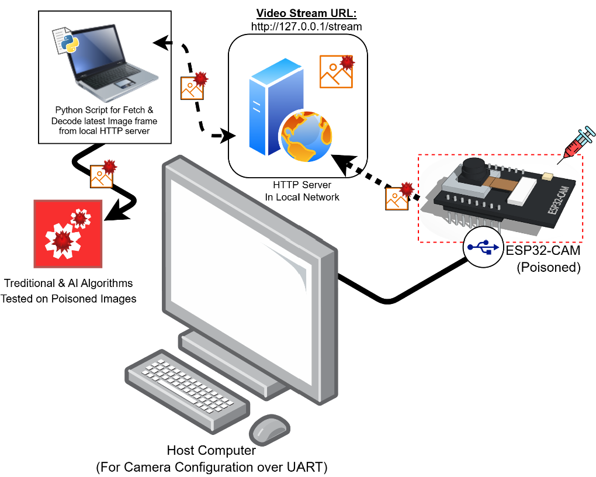
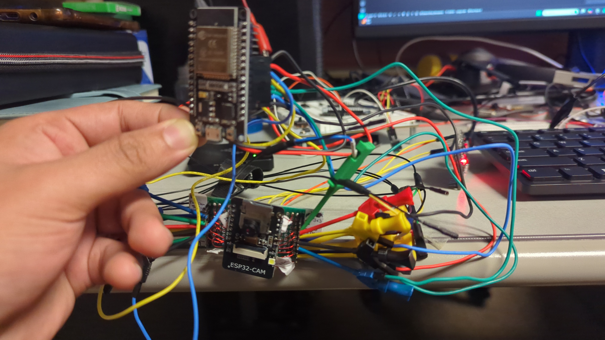
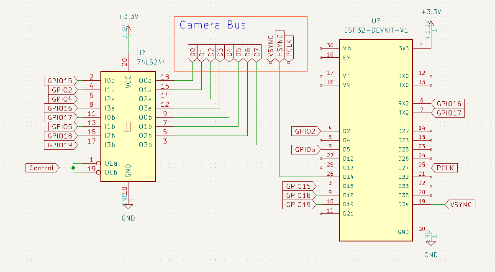
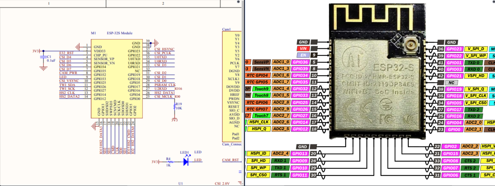
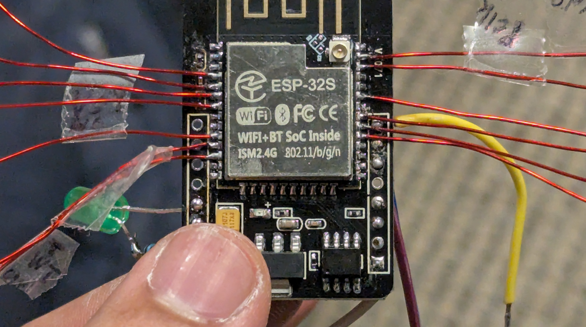

# PixMix Attack: Bus Poisoning on Digital Video Port(DVP) interface



PixMix is a probing attack on DVP interface that can menupulate image pixels in electrical signal level before it is decoded to image for further processing. This work is a comprehensive investigation of the potential of advarsarial attacks on AI software where advarsarial menupulation comes from the hardware instead of software. This work is a part of my Master's Thesis.


## Project File Structure
```
PixMix-DVP-Bus-poisoning/
├── Attacker/
│   ├── Grids/
│   ├── Horizontal-Lines/
│   └── Vertical-Lines/
|
├── Victim/
│   └── ESP32cam-Video-Streaming-over-HTTP-Firmware/
|
├── Image_Receiver_Client/
│   └── server_decode.ipynb 
|
├── Assets/
└── README.md
```

- `Attacker/`: Attack Firmware to inject lines and patterns into the image on the bus.
- `Victim/`: Firmware for the ESP32-CAM system streaming video.
- `Image_Receiver_Client/`: Scripts for receiving and decoding images from the camera stream.


## Experimental Setup
Experiments were conducted on ESP32-CAM as Target and an ESP32 as attacker. The system architecture is provided below.


Experimental system is contains 3 main components -

- `Target Hardware:` A camera (ESP32-CAM) streaming video.
- `Attacker Hardware:` ESP32 Microcontroller 
- `Video Receiver Client:` A computer receiving and decoding the images.


The setup in real has been provided below - 



The Wiring diagram for the above diagram is provided below:


Here a tri-state buffer has been used to control the state of the signal bus in precise timing instances and leave the bus for normal operation of targeted system. The physical DVP signal lines have been identified from the schematic design - 


The signal lines were probed from soldered extension thin wires.



[Read in Full Details at OhioLink](http://rave.ohiolink.edu/etdc/view?acc_num=wright174793161471583)
### Cite this work:
```
@mastersthesis{nowroz2025pixmix,
  author       = {Nowroz, Sayed Md Tashfi},
  title        = {PixMix Attack: Implementation and Evaluation of a Novel Pixel Injection on Digital Video Port (DVP) Interface in Embedded Camera Systems with PCB Hardware Trojan},
  school       = {Wright State University},
  year         = {2025},
  type         = {Master's thesis},
  url          = {http://rave.ohiolink.edu/etdc/view?acc_num=wright174793161471583},
  note         = {OhioLINK Electronic Theses and Dissertations Center}
}
```


